# MetaLend BNB

**Decentralized lending protocol on BNB Chain with autonomous liquidation bot, real-time analytics dashboard, and flash loan support.**

Built for the BNB Chain Hackathon 2026.

**Live Demo**
> https://drive.google.com/file/d/13e8nHPRonaf6vGzEy54uH2_ohfSIN0sk/view?usp=drivesdk
---

## Problem

DeFi lending on BNB Chain today is fragmented and intimidating:

1. **Capital sits idle** — BNB/BTC holders have no simple way to earn yield or access liquidity without selling
2. **Liquidations are manual** — Most protocols rely on external MEV bots; users get liquidated with no transparency
3. **UX is terrible** — Existing lending dApps overwhelm users with raw numbers, no risk visualization, no portfolio analytics
4. **No real-time alerts** — Users discover they've been liquidated after the fact

## Solution

MetaLend BNB is a **full-stack lending protocol** that solves all four:

| Problem | MetaLend Solution |
|---------|-------------------|
| Idle capital | Supply USDT to earn yield; borrow against BNB/BTC collateral |
| Manual liquidations | Built-in autonomous bot scans every 3s, executes via flash loans |
| Bad UX | Real-time charts, health factor bars, USD conversions, portfolio breakdown |
| No alerts | Liquidation bot with event monitoring + on-chain transparency |

---

## Target Users

| User Type | What They Do | Why MetaLend |
|-----------|-------------|--------------|
| **BNB/BTC Holders** | Hold crypto long-term | Borrow USDT against holdings without selling |
| **Yield Farmers** | Supply stablecoins | Earn utilization-based APY on USDT deposits |
| **Liquidation Bots** | Monitor undercollateralized positions | 10% bonus on seized collateral, flash-loan-assisted |
| **DeFi Developers** | Build on lending primitives | Open-source, flash loan API, composable markets |

---

## User Journey

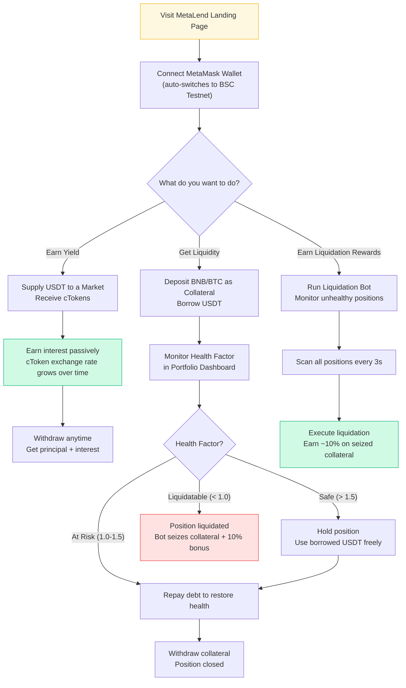

---

## System Architecture

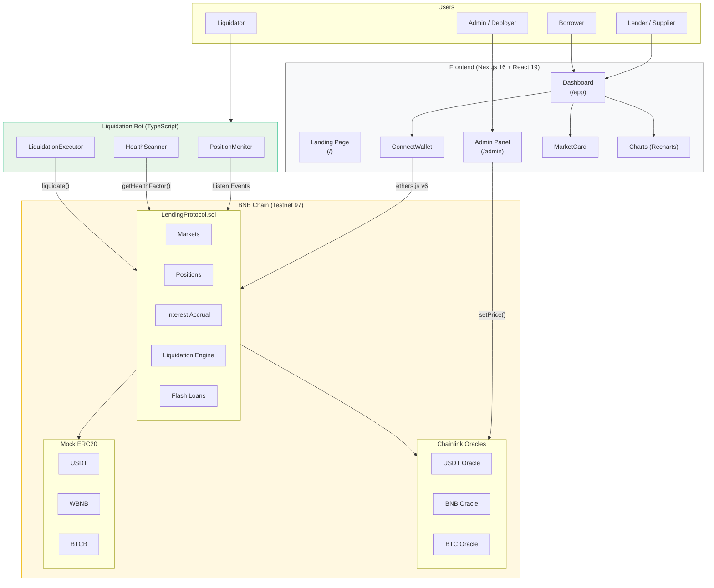

---

## Smart Contract Architecture

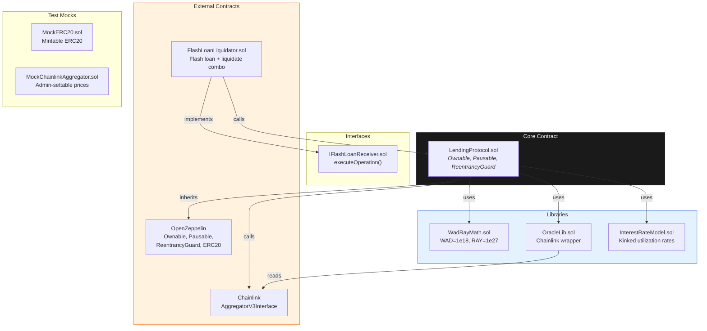

---

## Value Proposition

### For Lenders (Supply Side)
- **Passive yield** on USDT deposits — utilization-based APY (like Aave/Compound)
- **cToken model** — interest accrues automatically, withdraw anytime
- **Reserve factor** — protocol retains 10% of interest for sustainability

### For Borrowers (Demand Side)
- **Access liquidity without selling** — deposit BNB/BTC, borrow USDT
- **Real-time health monitoring** — color-coded health factor bar, USD conversions
- **Partial repayment** — repay any amount, even when protocol is paused

### For Liquidators
- **10% bonus** on seized collateral
- **Flash-loan-assisted** — no upfront capital needed
- **Autonomous bot** — scans every 3s, auto-executes profitable liquidations
- **100% close factor** — can liquidate entire debt in one transaction

### For the Ecosystem
- **Open-source** — fully composable, anyone can build on top
- **Flash loans** — 0.3% fee enables arbitrage, liquidations, refinancing
- **BNB Chain native** — low gas, fast finality, growing DeFi ecosystem

---

## Business / Token Model

### Revenue Streams

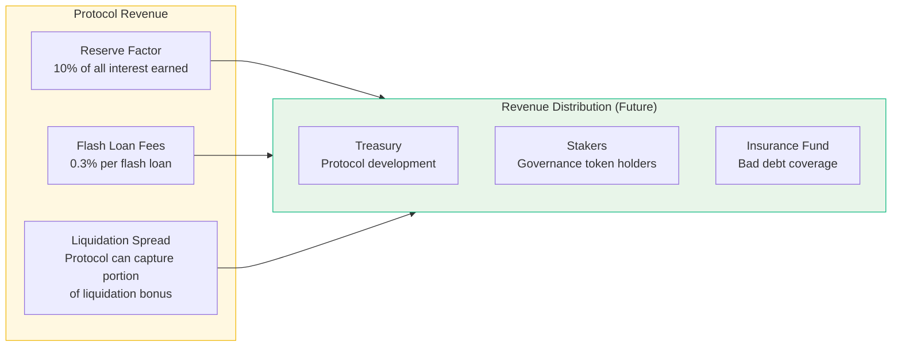

### Current Model (Hackathon / Testnet)
- **No token** — protocol is permissionless, revenue accrues to `totalReserves`
- Reserve factor: **10%** of interest goes to protocol reserves
- Flash loan fee: **0.3%** (30 bps) per flash loan

### Future Token Model (Post-Hackathon)
| Component | Description |
|-----------|-------------|
| **Governance Token (META)** | Vote on market parameters, collateral factors, fee rates |
| **Staking** | Stake META to earn share of protocol revenue (reserve factor + flash loan fees) |
| **Insurance Fund** | Portion of reserves backstops bad debt from liquidation failures |
| **Liquidity Mining** | Distribute META to suppliers/borrowers to bootstrap TVL |

---

## GTM Strategy

### Phase 1: Hackathon Launch (Now)
- Deploy on BSC Testnet with mock tokens
- 2 markets: WBNB/USDT + BTCB/USDT
- Full dashboard + liquidation bot demo
- Open-source codebase

### Phase 2: Community Bootstrap
- Deploy to BSC Mainnet with real assets (USDT, WBNB, BTCB)
- Integrate real Chainlink price feeds
- Launch liquidity mining program to attract initial TVL
- Partner with BNB Chain ecosystem projects (PancakeSwap, Venus comparisons)

### Phase 3: Growth
- Add more collateral types (ETH, SOL, BNB ecosystem tokens)
- Launch governance token (META)
- Telegram bot for position monitoring + liquidation alerts
- Cross-promote with BNB Chain DeFi aggregators (1inch, OpenOcean)

### Phase 4: Differentiation
- Multi-chain expansion (opBNB L2 for lower gas)
- Isolated lending markets (permissionless market creation)
- Real-world asset (RWA) collateral support
- Institutional API for market makers

### Target Metrics

| Metric | Hackathon | 3 Months | 6 Months |
|--------|-----------|----------|----------|
| Markets | 2 | 5-8 | 15+ |
| TVL | Testnet | $500K | $5M+ |
| Users | Demo | 500+ | 5,000+ |
| Liquidation Bot Uptime | Demo | 99.9% | 99.9% |

---

## Data Flow: Supply & Borrow

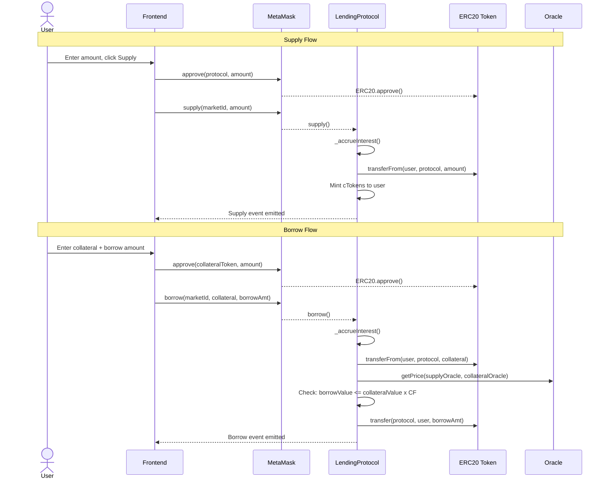

---

## Data Flow: Liquidation

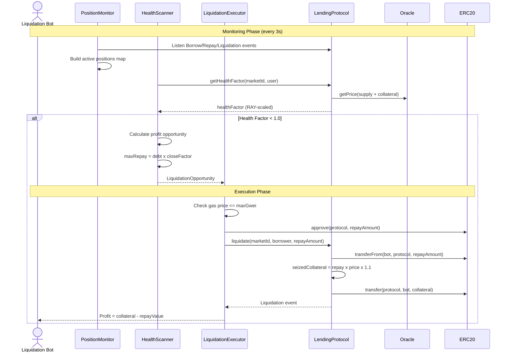

---

## Interest Rate Model

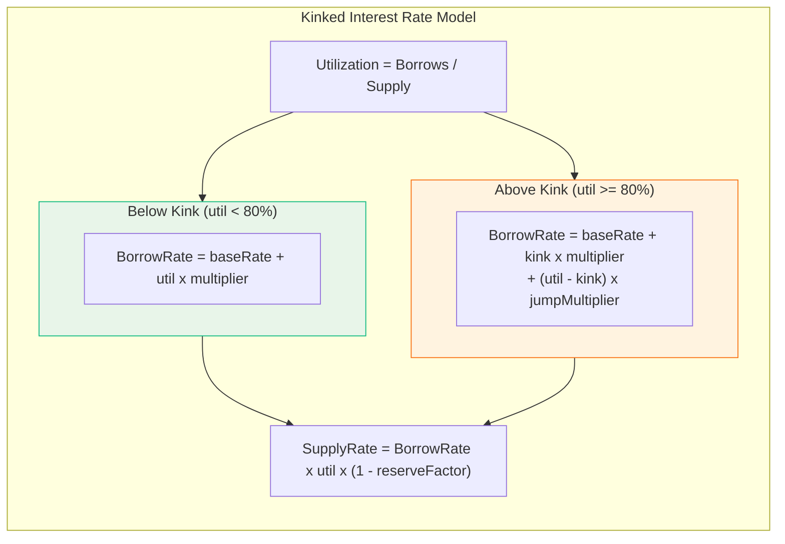

### Default Market Parameters

| Parameter | WBNB/USDT | BTCB/USDT |
|-----------|-----------|-----------|
| Collateral Factor | 80% | 75% |
| Liquidation Threshold | 85% | 80% |
| Liquidation Bonus | 10% | 10% |
| Base Rate | 2% | 2% |
| Multiplier | 10% | 10% |
| Jump Multiplier | 300% | 300% |
| Kink | 80% | 80% |
| Reserve Factor | 10% | 10% |

---

## Health Factor & Liquidation Logic

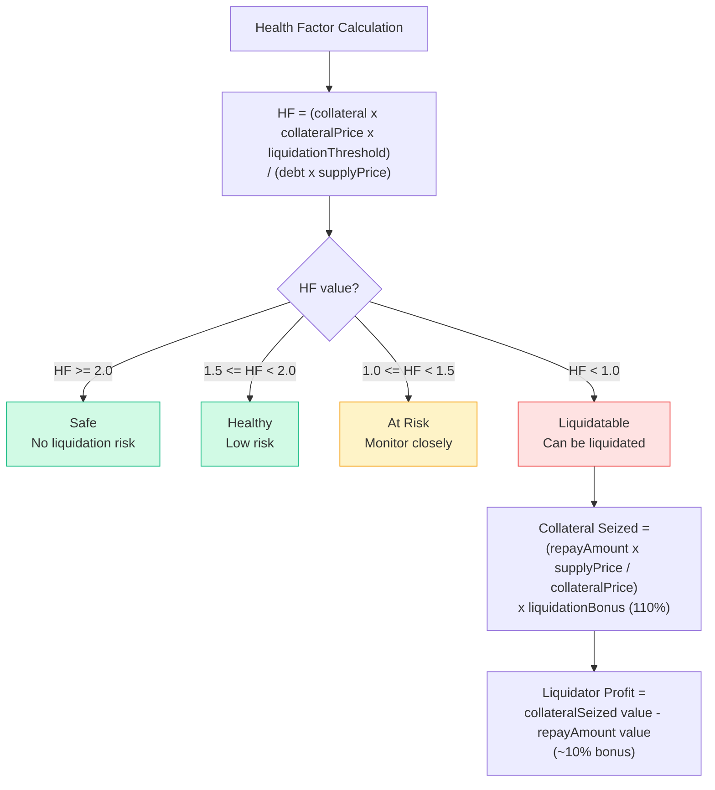

---

## Setup & Run Instructions

### Prerequisites
- **Node.js** >= 18
- **Foundry** ([install](https://book.getfoundry.sh/getting-started/installation))
- **MetaMask** browser extension

### 1. Smart Contracts
```bash
cd contracts
forge install
forge build
forge test -vv  # 26 tests passing
```

### 2. Deploy to BNB Testnet
```bash
cd contracts
echo "PRIVATE_KEY=your_private_key_here" > .env
forge script script/Deploy.s.sol:DeployScript \
  --rpc-url https://data-seed-prebsc-1-s1.bnbchain.org:8545 \
  --broadcast
```

### 3. Frontend
```bash
cd frontend
npm install
echo "NEXT_PUBLIC_PROTOCOL_ADDRESS=0x672c625114F3C59C6B9869F73a08afb311A66605" > .env.local
npm run dev    # http://localhost:3000
npm run build  # Production build
```

### 4. Liquidation Bot
```bash
cd bot
npm install
cp .env.example .env
# Fill in: RPC_URL, PRIVATE_KEY, LENDING_PROTOCOL_ADDRESS
npm run dev
```

---

## Frontend Architecture

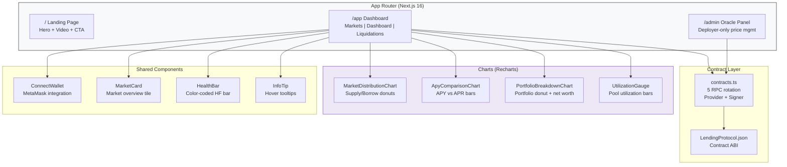

---

## Liquidation Bot Architecture

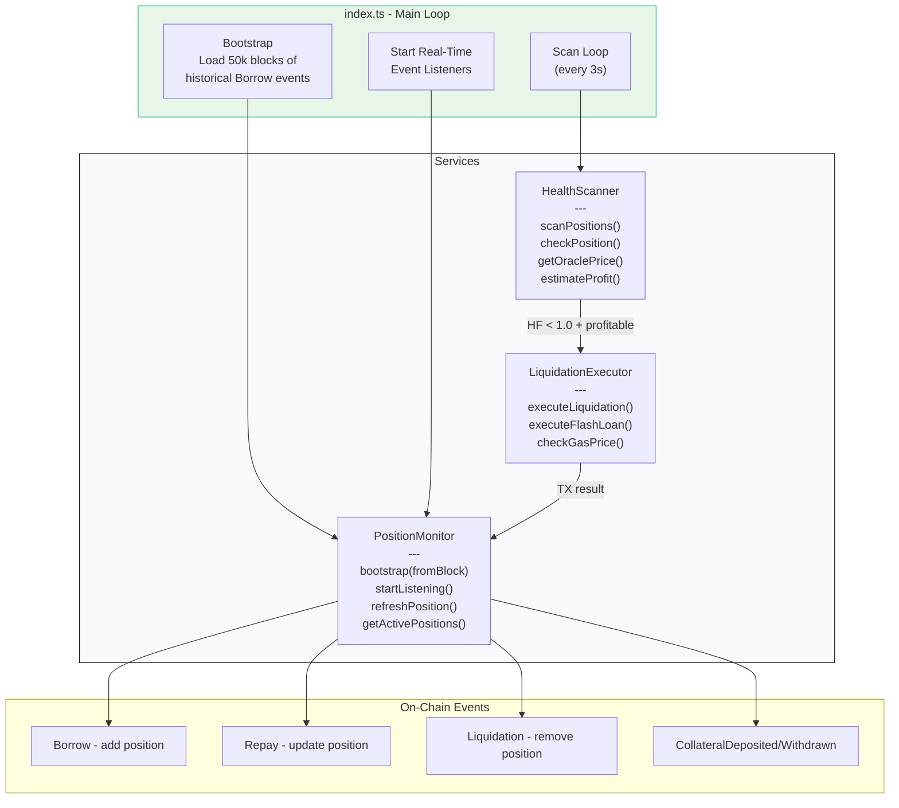

---

## Deployment Pipeline

```mermaid
graph LR
    subgraph Deploy["Deploy.s.sol"]
        D1["1. Deploy MockERC20s<br/>USDT, WBNB, BTCB"]
        D2["2. Deploy Mock Oracles<br/>USDT=$1, BNB=$600, BTC=$95K"]
        D3["3. Deploy LendingProtocol"]
        D4["4. Create Market 0<br/>WBNB/USDT (CF=80%)"]
        D5["5. Create Market 1<br/>BTCB/USDT (CF=75%)"]
        D6["6. Mint initial tokens<br/>to deployer"]
    end

    D1 --> D2 --> D3 --> D4 --> D5 --> D6

    subgraph Config["Frontend Config"]
        F1["Set PROTOCOL_ADDRESS<br/>in .env.local"]
        F2["Update TOKEN_NAMES<br/>mapping in page.tsx"]
        F3["Update oracle addresses<br/>in admin/page.tsx"]
    end

    D6 --> F1 --> F2 --> F3

    style Deploy fill:#FFF8E1,stroke:#F0B90B
    style Config fill:#f8f9fa,stroke:#1A1A1A
```

---

## Deployed Contracts (BSC Testnet)

| Contract | Address |
|----------|---------|
| LendingProtocol | `0x672c625114F3C59C6B9869F73a08afb311A66605` |
| USDT (Mock) | `0xaCACff158CF0835363e990Fc8a872e1599BBDDD8` |
| WBNB (Mock) | `0x3aB19925952191bc4d6eCF3bC5D54CfA8Ba1A6Bc` |
| BTCB (Mock) | `0xdCbc46262A3dCFbD750FF8cd07d41C50e0Ed2020` |
| USDT Oracle | `0xFc015236bEBceec6DF200A9512a3b3548967A274` |
| BNB Oracle | `0x8F3F65415bd7AEDB1DFB704E12FeD5b31D3c38ce` |
| BTC Oracle | `0x030adD56f70B6903BD3bCE647a1f57314CfFCE20` |

---

## Tech Stack

| Layer | Technology | Version |
|-------|-----------|---------|
| Smart Contracts | Solidity, Foundry, OpenZeppelin | 0.8.30 |
| Oracles | Chainlink AggregatorV3 (Mock on testnet) | -- |
| Bot | TypeScript, ethers.js | v6 |
| Frontend | Next.js, React, TypeScript | 16.1.6 / 19 / 5 |
| Styling | Tailwind CSS v4, Framer Motion | v4 / 12 |
| Charts | Recharts | 2 |
| Wallet | MetaMask (browser extension) | -- |
| Network | BNB Smart Chain Testnet | Chain 97 |

---

## Project Structure

```
metalend-bnb/
├── contracts/                    # Foundry (Solidity 0.8.30)
│   ├── src/
│   │   ├── LendingProtocol.sol              # Core protocol (623 lines)
│   │   ├── FlashLoanLiquidator.sol          # Flash loan liquidation receiver
│   │   ├── libraries/
│   │   │   ├── WadRayMath.sol               # Fixed-point math (WAD=1e18, RAY=1e27)
│   │   │   ├── OracleLib.sol                # Chainlink oracle + staleness check
│   │   │   └── InterestRateModel.sol        # Kinked utilization-based rates
│   │   └── interfaces/
│   │       └── IFlashLoanReceiver.sol       # Flash loan callback
│   ├── test/
│   │   ├── LendingProtocol.t.sol            # 26 tests
│   │   └── mocks/
│   │       ├── MockERC20.sol                # Mintable test token
│   │       └── MockChainlinkAggregator.sol  # Admin-settable price feed
│   ├── script/
│   │   └── Deploy.s.sol                     # Testnet deployment (2 markets)
│   └── foundry.toml                         # Solc 0.8.30, via_ir enabled
│
├── frontend/                     # Next.js 16.1.6 + React 19
│   ├── src/
│   │   ├── app/
│   │   │   ├── page.tsx                     # Landing page
│   │   │   ├── app/page.tsx                 # Dashboard (Markets/Portfolio/Liquidations)
│   │   │   ├── admin/page.tsx               # Oracle price management
│   │   │   ├── layout.tsx                   # Root layout (Inter font)
│   │   │   └── globals.css                  # Tailwind v4 imports
│   │   ├── components/
│   │   │   ├── ConnectWallet.tsx             # MetaMask connect/switch/disconnect
│   │   │   ├── MarketCard.tsx               # Market overview card
│   │   │   ├── HealthBar.tsx                # Health factor visualization
│   │   │   ├── InfoTip.tsx                  # Hover tooltips
│   │   │   └── charts/
│   │   │       ├── MarketDistributionChart.tsx  # Supply/borrow donut charts
│   │   │       ├── ApyComparisonChart.tsx       # APY vs APR bar chart
│   │   │       ├── PortfolioBreakdownChart.tsx  # Portfolio allocation donut
│   │   │       └── UtilizationGauge.tsx         # Pool utilization bars
│   │   └── lib/
│   │       ├── contracts.ts                 # 5 RPC rotation, provider helpers
│   │       └── LendingProtocol.json         # Contract ABI
│   └── package.json
│
├── bot/                          # TypeScript liquidation bot
│   ├── src/
│   │   ├── index.ts                         # Entry point + main scan loop
│   │   ├── config.ts                        # Env vars + constants
│   │   ├── services/
│   │   │   ├── PositionMonitor.ts           # Event-driven position tracking
│   │   │   ├── HealthScanner.ts             # HF scanning + profit estimation
│   │   │   └── LiquidationExecutor.ts       # TX execution + gas management
│   │   ├── types/index.ts                   # TypeScript interfaces
│   │   └── utils/logger.ts                  # Logging
│   ├── abi/LendingProtocol.json             # Contract ABI
│   └── package.json
│
├── README.md                     # This file
└── docs.md                       # Detailed documentation
```

---

## Core Smart Contract Functions

| Function | Description | Access |
|----------|-------------|--------|
| `createMarket()` | Create lending market with token pair + params | Owner only |
| `supply(marketId, amount)` | Deposit supply tokens, receive cTokens | whenNotPaused |
| `withdraw(marketId, ctokens)` | Burn cTokens, receive underlying + interest | whenNotPaused |
| `borrow(marketId, collateral, amount)` | Lock collateral, borrow supply tokens | whenNotPaused |
| `repay(marketId, amount)` | Repay borrowed tokens | Always (even paused) |
| `withdrawCollateral(marketId, amount)` | Withdraw collateral (health check) | whenNotPaused |
| `liquidate(marketId, borrower, amount)` | Liquidate unhealthy position (HF < 1.0) | Always (even paused) |
| `flashLoan(marketId, amount, receiver, data)` | Borrow + repay in one tx (0.3% fee) | whenNotPaused |

---

## Protocol Constants

| Constant | Value | Description |
|----------|-------|-------------|
| RAY | 1e27 | High-precision scaling factor |
| WAD | 1e18 | Standard ERC20 precision |
| BASIS_POINTS | 10,000 | 100% = 10000 basis points |
| MAX_CLOSE_FACTOR | 10,000 | 100% of debt can be liquidated |
| FLASH_LOAN_FEE | 30 bps | 0.3% flash loan fee |
| SECONDS_PER_YEAR | 31,557,600 | 365.25 days |

---

## Improvements Over Original Solana MetaLend

1. **Interest Model**: Flat 2%/1% -> utilization-based kinked model (like Aave/Compound)
2. **Liquidation Fix**: Proper dual-price conversion (original used same oracle for both assets)
3. **Close Factor**: 50% -> 100% (full debt can be liquidated per tx)
4. **Reserve Factor**: Protocol captures 10% of interest
5. **Partial Collateral Withdrawal**: Allowed if health factor stays > 1.0
6. **Flash Loan Safety**: EVM ReentrancyGuard (vs Solana's unsafe `mem::transmute`)
7. **Oracle Integration**: Chainlink with staleness validation (1hr max)

---

## Testing

All 26 tests passing (`forge test -vv`):

| Category | Tests |
|----------|-------|
| Market Creation | 3 (valid + 2 revert cases) |
| Supply/Withdraw | 5 (single/multi user, exchange rate) |
| Borrow/Repay | 5 (collateral validation, max borrow, health) |
| Liquidation | 5 (price drops, bonus, close factor) |
| Collateral Withdrawal | 3 (health checks, partial) |
| Flash Loans | 3 (basic, fees, repayment) |
| Interest Accrual | 2 (time-based, cToken rate changes) |

---

## Roadmap

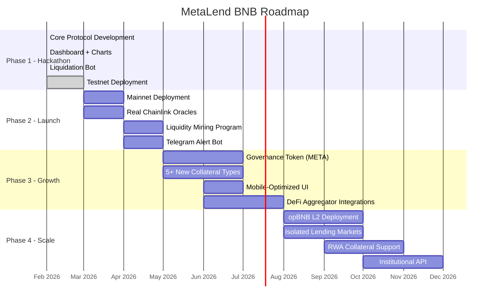

---

## License

MIT
