# MetaLend BNB - DeFi Lending Protocol

A decentralized lending protocol on BNB Chain with autonomous liquidation bot, real-time dashboard, and flash loan support. Built for the BNB Chain Hackathon 2026.

---

## High-Level Architecture


---

## Smart Contract Architecture


---

## Data Flow: Supply & Borrow

```mermaid
sequenceDiagram
    actor User
    participant Frontend
    participant MetaMask
    participant Protocol as LendingProtocol
    participant Token as ERC20 Token
    participant Oracle

    Note over User,Oracle: Supply Flow
    User->>Frontend: Enter amount, click Supply
    Frontend->>MetaMask: approve(protocol, amount)
    MetaMask-->>Token: ERC20.approve()
    Frontend->>MetaMask: supply(marketId, amount)
    MetaMask-->>Protocol: supply()
    Protocol->>Protocol: _accrueInterest()
    Protocol->>Token: transferFrom(user, protocol, amount)
    Protocol->>Protocol: Mint cTokens to user
    Protocol-->>Frontend: Supply event emitted

    Note over User,Oracle: Borrow Flow
    User->>Frontend: Enter collateral + borrow amount
    Frontend->>MetaMask: approve(collateralToken, amount)
    MetaMask-->>Token: ERC20.approve()
    Frontend->>MetaMask: borrow(marketId, collateral, borrowAmt)
    MetaMask-->>Protocol: borrow()
    Protocol->>Protocol: _accrueInterest()
    Protocol->>Token: transferFrom(user → protocol, collateral)
    Protocol->>Oracle: getPrice(supplyOracle, collateralOracle)
    Protocol->>Protocol: Check: borrowValue ≤ collateralValue × CF
    Protocol->>Token: transfer(protocol → user, borrowAmt)
    Protocol-->>Frontend: Borrow event emitted
```



---

## Data Flow: Liquidation

```mermaid
sequenceDiagram
    actor Bot as Liquidation Bot
    participant Monitor as PositionMonitor
    participant Scanner as HealthScanner
    participant Executor as LiquidationExecutor
    participant Protocol as LendingProtocol
    participant Oracle
    participant Token as ERC20

    Note over Bot,Token: Monitoring Phase (every 3s)
    Monitor->>Protocol: Listen Borrow/Repay/Liquidation events
    Monitor->>Monitor: Build active positions map

    Scanner->>Protocol: getHealthFactor(marketId, user)
    Protocol->>Oracle: getPrice(supply + collateral)
    Protocol-->>Scanner: healthFactor (RAY-scaled)

    alt Health Factor < 1.0
        Scanner->>Scanner: Calculate profit opportunity
        Scanner->>Scanner: maxRepay = debt × closeFactor
        Scanner-->>Executor: LiquidationOpportunity

        Note over Bot,Token: Execution Phase
        Executor->>Executor: Check gas price ≤ maxGwei
        Executor->>Token: approve(protocol, repayAmount)
        Executor->>Protocol: liquidate(marketId, borrower, repayAmount)
        Protocol->>Token: transferFrom(bot → protocol, repayAmount)
        Protocol->>Protocol: seizedCollateral = repay × price × 1.1
        Protocol->>Token: transfer(protocol → bot, collateral)
        Protocol-->>Executor: Liquidation event
        Executor-->>Bot: Profit = collateral - repayValue
    end
```



---

## Interest Rate Model

```mermaid
graph LR
    subgraph Model["Kinked Interest Rate Model"]
        direction TB
        U["Utilization = Borrows / Supply"]

        subgraph Below["Below Kink (util < 80%)"]
            BR1["BorrowRate = baseRate + util × multiplier"]
        end

        subgraph Above["Above Kink (util ≥ 80%)"]
            BR2["BorrowRate = baseRate + kink × multiplier<br/>+ (util - kink) × jumpMultiplier"]
        end

        SR["SupplyRate = BorrowRate × util × (1 - reserveFactor)"]
    end

    U --> Below
    U --> Above
    Below --> SR
    Above --> SR

    style Below fill:#E8F5E9,stroke:#10B981
    style Above fill:#FFF3E0,stroke:#F97316
```



### Default Market Parameters

| Parameter | WBNB/USDT | BTCB/USDT |
|-----------|-----------|-----------|
| Collateral Factor | 80% | 75% |
| Liquidation Threshold | 85% | 80% |
| Liquidation Bonus | 10% | 10% |
| Base Rate | 2% | 2% |
| Multiplier | 10% | 10% |
| Jump Multiplier | 300% | 300% |
| Kink | 80% | 80% |
| Reserve Factor | 10% | 10% |

---

## Frontend Architecture


### Dashboard Tab Flow


---

## Liquidation Bot Architecture

```mermaid
graph TD
    subgraph Entry["index.ts - Main Loop"]
        BOOT["Bootstrap<br/>Load 50k blocks of<br/>historical Borrow events"]
        LISTEN["Start Real-Time<br/>Event Listeners"]
        SCAN["Scan Loop<br/>(every 3s)"]
    end

    subgraph Services["Services"]
        PM["PositionMonitor<br/>──────────<br/>• bootstrap(fromBlock)<br/>• startListening()<br/>• refreshPosition()<br/>• getActivePositions()"]

        HS["HealthScanner<br/>──────────<br/>• scanPositions()<br/>• checkPosition()<br/>• getOraclePrice()<br/>• estimateProfit()"]

        LE["LiquidationExecutor<br/>──────────<br/>• executeLiquidation()<br/>• executeFlashLoan()<br/>• checkGasPrice()"]
    end

    subgraph Events["On-Chain Events"]
        E1["Borrow → add position"]
        E2["Repay → update position"]
        E3["Liquidation → remove position"]
        E4["CollateralDeposited/Withdrawn"]
    end

    BOOT --> PM
    LISTEN --> PM
    SCAN --> HS
    HS -->|"HF < 1.0 + profitable"| LE
    LE -->|"TX result"| PM

    PM --> E1
    PM --> E2
    PM --> E3
    PM --> E4

    style Entry fill:#E8F5E9,stroke:#10B981
    style Services fill:#f8f9fa,stroke:#1A1A1A
```



---

## Health Factor & Liquidation Logic

```mermaid
graph TD
    HF["Health Factor Calculation"]

    HF --> FORMULA["HF = (collateral × collateralPrice × liquidationThreshold)<br/>÷ (debt × supplyPrice)"]

    FORMULA --> CHECK{HF value?}

    CHECK -->|"HF ≥ 2.0"| SAFE["🟢 Safe<br/>No liquidation risk"]
    CHECK -->|"1.5 ≤ HF < 2.0"| HEALTHY["🟢 Healthy<br/>Low risk"]
    CHECK -->|"1.0 ≤ HF < 1.5"| ATRISK["🟡 At Risk<br/>Monitor closely"]
    CHECK -->|"HF < 1.0"| LIQUIDATABLE["🔴 Liquidatable<br/>Can be liquidated"]

    LIQUIDATABLE --> SEIZE["Collateral Seized =<br/>(repayAmount × supplyPrice ÷ collateralPrice)<br/>× liquidationBonus (110%)"]

    SEIZE --> PROFIT["Liquidator Profit =<br/>collateralSeized value - repayAmount value<br/>(~10% bonus)"]

    style SAFE fill:#D1FAE5,stroke:#10B981
    style HEALTHY fill:#D1FAE5,stroke:#10B981
    style ATRISK fill:#FEF3C7,stroke:#F59E0B
    style LIQUIDATABLE fill:#FEE2E2,stroke:#EF4444
```



---

## Deployment Pipeline


---

## Project Structure

```
metalend-bnb/
├── contracts/                    # Foundry (Solidity 0.8.30)
│   ├── src/
│   │   ├── LendingProtocol.sol              # Core protocol (623 lines)
│   │   ├── FlashLoanLiquidator.sol          # Flash loan liquidation receiver
│   │   ├── libraries/
│   │   │   ├── WadRayMath.sol               # Fixed-point math (WAD=1e18, RAY=1e27)
│   │   │   ├── OracleLib.sol                # Chainlink oracle + staleness check
│   │   │   └── InterestRateModel.sol        # Kinked utilization-based rates
│   │   └── interfaces/
│   │       └── IFlashLoanReceiver.sol       # Flash loan callback
│   ├── test/
│   │   ├── LendingProtocol.t.sol            # 26 tests
│   │   └── mocks/
│   │       ├── MockERC20.sol                # Mintable test token
│   │       └── MockChainlinkAggregator.sol  # Admin-settable price feed
│   ├── script/
│   │   └── Deploy.s.sol                     # Testnet deployment (2 markets)
│   └── foundry.toml                         # Solc 0.8.30, via_ir enabled
│
├── frontend/                     # Next.js 16.1.6 + React 19
│   ├── src/
│   │   ├── app/
│   │   │   ├── page.tsx                     # Landing page
│   │   │   ├── app/page.tsx                 # Dashboard (Markets/Portfolio/Liquidations)
│   │   │   ├── admin/page.tsx               # Oracle price management
│   │   │   ├── layout.tsx                   # Root layout (Inter font)
│   │   │   └── globals.css                  # Tailwind v4 imports
│   │   ├── components/
│   │   │   ├── ConnectWallet.tsx             # MetaMask connect/switch/disconnect
│   │   │   ├── MarketCard.tsx               # Market overview card
│   │   │   ├── HealthBar.tsx                # Health factor visualization
│   │   │   ├── InfoTip.tsx                  # Hover tooltips
│   │   │   └── charts/
│   │   │       ├── MarketDistributionChart.tsx  # Supply/borrow donut charts
│   │   │       ├── ApyComparisonChart.tsx       # APY vs APR bar chart
│   │   │       ├── PortfolioBreakdownChart.tsx  # Portfolio allocation donut
│   │   │       └── UtilizationGauge.tsx         # Pool utilization bars
│   │   └── lib/
│   │       ├── contracts.ts                 # 5 RPC rotation, provider helpers
│   │       └── LendingProtocol.json         # Contract ABI
│   └── package.json
│
├── bot/                          # TypeScript liquidation bot
│   ├── src/
│   │   ├── index.ts                         # Entry point + main scan loop
│   │   ├── config.ts                        # Env vars + constants
│   │   ├── services/
│   │   │   ├── PositionMonitor.ts           # Event-driven position tracking
│   │   │   ├── HealthScanner.ts             # HF scanning + profit estimation
│   │   │   └── LiquidationExecutor.ts       # TX execution + gas management
│   │   ├── types/index.ts                   # TypeScript interfaces
│   │   └── utils/logger.ts                  # Logging
│   ├── abi/LendingProtocol.json             # Contract ABI
│   └── package.json
│
├── README.md                     # This file
└── docs.md                       # Detailed documentation
```

---

## Tech Stack

| Layer | Technology | Version |
|-------|-----------|---------|
| Smart Contracts | Solidity, Foundry, OpenZeppelin | 0.8.30 |
| Oracles | Chainlink AggregatorV3 (Mock on testnet) | — |
| Bot | TypeScript, ethers.js | v6 |
| Frontend | Next.js, React, TypeScript | 16.1.6 / 19 / 5 |
| Styling | Tailwind CSS v4, Framer Motion | v4 / 12 |
| Charts | Recharts | 2 |
| Wallet | MetaMask (browser extension) | — |
| Network | BNB Smart Chain Testnet | Chain 97 |

---

## Deployed Contracts (BSC Testnet)

| Contract | Address |
|----------|---------|
| LendingProtocol | `0x672c625114F3C59C6B9869F73a08afb311A66605` |
| USDT (Mock) | `0xaCACff158CF0835363e990Fc8a872e1599BBDDD8` |
| WBNB (Mock) | `0x3aB19925952191bc4d6eCF3bC5D54CfA8Ba1A6Bc` |
| BTCB (Mock) | `0xdCbc46262A3dCFbD750FF8cd07d41C50e0Ed2020` |
| USDT Oracle | `0xFc015236bEBceec6DF200A9512a3b3548967A274` |
| BNB Oracle | `0x8F3F65415bd7AEDB1DFB704E12FeD5b31D3c38ce` |
| BTC Oracle | `0x030adD56f70B6903BD3bCE647a1f57314CfFCE20` |

---

## Quick Start

### Smart Contracts
```bash
cd contracts
forge install
forge build
forge test -vv  # 26 tests passing
```

### Deploy to BNB Testnet
```bash
cd contracts
# Set PRIVATE_KEY in .env
forge script script/Deploy.s.sol:DeployScript \
  --rpc-url https://data-seed-prebsc-1-s1.bnbchain.org:8545 \
  --broadcast
```

### Frontend
```bash
cd frontend
npm install
# Set NEXT_PUBLIC_PROTOCOL_ADDRESS in .env.local
npm run dev    # http://localhost:3000
npm run build  # Production build
```

### Liquidation Bot
```bash
cd bot
npm install
cp .env.example .env  # Fill in RPC_URL, PRIVATE_KEY, LENDING_PROTOCOL_ADDRESS
npm run dev
```

---

## Core Smart Contract Functions

| Function | Description | Access |
|----------|-------------|--------|
| `createMarket()` | Create lending market with token pair + params | Owner only |
| `supply(marketId, amount)` | Deposit supply tokens, receive cTokens | whenNotPaused |
| `withdraw(marketId, ctokens)` | Burn cTokens, receive underlying + interest | whenNotPaused |
| `borrow(marketId, collateral, amount)` | Lock collateral, borrow supply tokens | whenNotPaused |
| `repay(marketId, amount)` | Repay borrowed tokens | Always (even when paused) |
| `withdrawCollateral(marketId, amount)` | Withdraw collateral (health check) | whenNotPaused |
| `liquidate(marketId, borrower, amount)` | Liquidate unhealthy position (HF < 1.0) | Always (even when paused) |
| `flashLoan(marketId, amount, receiver, data)` | Borrow + repay in one tx (0.3% fee) | whenNotPaused |

---

## Protocol Constants

| Constant | Value | Description |
|----------|-------|-------------|
| RAY | 1e27 | High-precision scaling factor |
| WAD | 1e18 | Standard ERC20 precision |
| BASIS_POINTS | 10,000 | 100% = 10000 basis points |
| MAX_CLOSE_FACTOR | 10,000 | 100% of debt can be liquidated |
| FLASH_LOAN_FEE | 30 bps | 0.3% flash loan fee |
| SECONDS_PER_YEAR | 31,557,600 | 365.25 days |

---

## Improvements Over Original Solana MetaLend

1. **Interest Model**: Flat 2%/1% → utilization-based kinked model (like Aave/Compound)
2. **Liquidation Fix**: Proper dual-price conversion (original used same oracle for both assets)
3. **Close Factor**: 50% → 100% (full debt can be liquidated per tx)
4. **Reserve Factor**: Protocol captures 10% of interest
5. **Partial Collateral Withdrawal**: Allowed if health factor stays > 1.0
6. **Flash Loan Safety**: EVM ReentrancyGuard (vs Solana's unsafe `mem::transmute`)
7. **Oracle Integration**: Chainlink with staleness validation (1hr max)

---

## Testing

All 26 tests passing (`forge test -vv`):

| Category | Tests |
|----------|-------|
| Market Creation | 3 (valid + 2 revert cases) |
| Supply/Withdraw | 5 (single/multi user, exchange rate) |
| Borrow/Repay | 5 (collateral validation, max borrow, health) |
| Liquidation | 5 (price drops, bonus, close factor) |
| Collateral Withdrawal | 3 (health checks, partial) |
| Flash Loans | 3 (basic, fees, repayment) |
| Interest Accrual | 2 (time-based, cToken rate changes) |

---

## End-to-End Flow


---

## License

MIT
